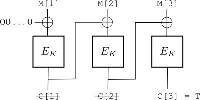
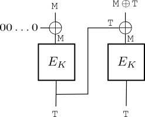
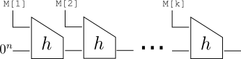
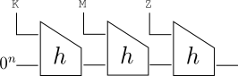
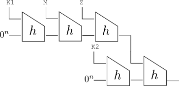

********************************************************************
Authentication and Integrity from Message Authentication Codes
********************************************************************

The Problem
====================
Recall the fundamental problem that cryptography is trying to address: Alice and Bob want to securely communicate
over an insecure channel with an adversary, Eve, who is trying to read and modify messages.  We saw in the previous 
chapter cryptographic tools that allow Alice and Bob to keep their communications private.  Unfortunately, as the 
last example in the chapter illustrated, even "perfect" encryption schemes do not prevent an adversary from modifying, 
or even sending her own, encrypted messages.  Since, in addition to privacy, we also want authenticity and integrity, we 
will need to introduce a new tool called **Message Authentication Codes**, or **MACs** for short.

Basics of Message Authentication Codes
========================================

Let us focus on the problem of protecting the integrity of a message, call it :math:`M`, that Alice wishes to send to Bob.  Alice 
is concerned that Eve will change the message while it is in-transit, resulting in Bob receiving a message that is 
different from the one she sent.  A Message Authentication Code is a symmetric cryptographic tool, so we can assume that 
Alice and Bob share a key :math:`K`. 

In order to protect the integrity of her message, Alice will use this key to generate "proof" 
that the message came from her.  This proof will be a bit string 
called the **tag**, which we denote with :math:`T`.  Alice then sends Bob both the message and the tag.
Bob, upon receiving :math:`M` and :math:`T`, will use the key to verify that the tag is a valid proof for the message he received. 
Why will this protect the integrity?  The idea is that Eve, if she wants to modify the message, will also have to modify the tag.  But without the key, Eve will not be able to do this correctly.

Let's formalize the above informal description of a message authentication code.  A message authentication code, 
or MAC for short, consists of two programs, :math:`\mathtt{mac}` and 
:math:`\mathtt{verify}`.  The program :math:`\mathtt{mac}` takes 
as input the key :math:`K` and a message :math:`M`, and outputs a 
tag :math:`T`.  The :math:`\mathtt{verify}` program takes as 
input key :math:`K`, message :math:`M`, and tag :math:`T`, and 
outputs either *accept* or *reject*. 
It should be the case that :math:`\mathtt{verify}(K, M, \mathtt{mac}(K, M)) = \mathit{accept}`.
Typically, :math:`\mathtt{verify}(K,M,T)` will simply recompute the MAC with :math:`\mathtt{mac}(K,M)` and compare 
the result to :math:`T`, outputting *accept* if they match and *reject* otherwise.

Now, in our scenario above, Alice will compute a tag using the :math:`\mathtt{mac}` program and the key :math:`K`.  Bob, upon receiving 
:math:`M` and :math:`T`, will compute :math:`\mathtt{verify}(K,M,T)`.  If the program outputs *accept*, Bob will believe the message 
came from Alice and was not tampered with. However, if the program outputs *reject*, Bob knows something went wrong, so he discards the message.

We will discuss security requirements of MACs in more detail later, but informally an adversary, after seeing 
numerous messages and their corresponding tags, should not be able to generate a valid tag for a new message.  For 
example, after seeing messages "hello", "we should meet tonight", and "goodbye" along with their corresponding tags, Eve should not be able to generate a valid tag for a new message like "you are bad".  If Eve is able to do this, we call this **forging**, or generating a forgery.

 
.. note::
   The tag should be a fixed size, meaning the tag for a short message is the same length as the tag for a long message.  Tags should also be relatively short, a few hundred bits.  What if the tag is *too* short?  For example, what if the tag were only 4 bits long? 

"Perfect" MACs
=================

Given the description in the previous section, what would a perfect message authentication code look like if 
we had absolutely no computational constraints?  

Suppose that the key shared by Alice and Bob is actually an infinitely large table.  This table has two columns, 
with the left column containing every possible message of every possible length, while the right column contains 
completely random 160 bit strings.  So the beginning of the table might look something like

.. math::
   \begin{array}{r|c}
   \mathbf{Message} & \mathbf{Tag}\\
   \hline
   0 & 01001010 \ldots 100\\
   1 & 10111010 \ldots 011\\
   00 & 00010101 \ldots 101\\
   01 & 01011111 \ldots 000\\
   10 & 10010000 \ldots 100\\
   11 & 00111010 \ldots 001\\
   000 & 11110110 \ldots 011\\
   ... & ...
   \end{array} 

We will often refer to this as a private random table.  If Alice wants to send Bob a message M, she simply looks up :math:`M` in the left column to find the corresponding 
tag :math:`T` in the right column.  She sends Bob :math:`(M,T)`.  Bob, who also has an identical 
copy of the table, will take the message he receives, look it up in the left column, and make sure the value 
in the right column at that row matches the tag he received. 

Why is this secure?  Suppose Eve (who does *not* have access to the table), wants to generate a forgery for 
a new message 010101.  If Eve wants Bob to believe this message came from Alice, she will need to determine 
the correct tag.  But without access to this table, the best she can do is guess the 160 bit tag.  Since the 
tags in the table were randomly generated, there are :math:`2^{160}` possible tags that are equally likely, meaning Eve has only a :math:`1/2^{160}` chance of success.  How small 
is this?  :math:`1/2^{160}` is

.. math::
   \frac{1}{1461501637330902918203684832716283019655932542976}

while one source (at the time of this writing) places the odds of Eve's house being hit by a meteor at 

.. math::
   \frac{1}{182138880000000}

So, the "perfect" MAC described above seems to give us everything we want.  Unfortunately, the table 
described above is infinitely large, so it can't possibly be used as a key.  Just like in building encryption schemes, we want short keys (at most a few hundred bits).  Our goal in the next few sections will be to try to emulate this perfect MAC scheme as much as possible, but with short keys.

Using Blockciphers?
======================

If we are trying to emulate the private random table from the previous section, 
we need a way to use a short key to take messages of varying lengths and generate random-looking 
values.  An obvious 
starting point might be to use the blockciphers and modes of operations we explored in the privacy chapter, 
since ciphertexts of secure encryption schemes are "random-looking".  

One additional challenge with MACs, however, is that tags should be a short, fixed size, regardless 
of the size of the message.  Let's try a few possibilities.

A first attempt: ECB-XOR-MAC
------------------------------ 

Our first attempt at building a MAC will be to apply the ECB mode of operation with the AES blockcipher, and 
then XOR together all of the ciphertext blocks, giving a 128 bit tag.  Specifically, given 
blockcipher :math:`E_K`, :math:`\mathtt{mac}(K,M)`
splits the message into blocks :math:`M[1]M[2]\ldots M[k]`, and returns :math:`E_K(M[1]) \oplus E_K(M[2]) \oplus \ldots \oplus E_K(M[k])`.  The verification program :math:`\mathtt{verify}(K,M,T)` simply recomputes the tag and compares it to :math:`T`.

Is this MAC secure?  It turns out that it is not secure.  To show this, we describe how an adversary can generate a forgery.  
Recall that an adversary's goal with a MAC is, after seeing some number of messages and their corresponding tags, to generate a 
valid tag for some new message.  This is a forgery.

To see how Eve can generate a forgery against ECB-XOR-MAC, suppose she has observed Alice send Bob a two-block 
message :math:`M[1]M[2]` and the corresponding valid tag :math:`T^*`.  It turns out that Eve can easily find a valid 
tag for a new message :math:`M[2]M[1]` with the two blocks swapped.  The valid tag for this new message is actually 
just :math:`T^*`, the same tag that was valid for the original message.  To see why, note that :math:`T^*` is

.. math::
   E_K(M[1]) \oplus E_K(M[2])

But, as we saw in the privacy chapter, XOR is commutative, so this is the same as 

.. math::
   E_K(M[2]) \oplus E_K(M[1])

which is a valid tag for the new message :math:`M[2]M[1]`.  Eve has generated a forgery!

A second attempt: CBC-MAC
--------------------------

For our next attempt, we try to use CBC mode.  We again need to solve the problem of keeping the tag short.  To do 
this, we will actually throw away every ciphertext block except the last one.  There is also an additional complication 
with using CBC: what should the IV be?  We will just set the IV to all 0s.  We call the resulting MAC **CBC-MAC**.

CBC-MAC, applied to a 3 block message, is shown below.

CBC-MAC has security issues if it is used to authenticate messages of varying block lengths.  To see this, suppose Eve 
observes Alice send the one-block message :math:`M` and the corresponding tag :math:`T`.  Eve can now generate a two 
block forgery with message :math:`M||M \oplus T` and tag :math:`T`.  
The issue is that when applying CBC mode to :math:`M||M \oplus T`, the first ciphertext block 
is :math:`T=\mathtt{enc}(K,M)`, which is then XORed with the second message block.  Since the second message 
block is :math:`M \oplus T`, XORing in another :math:`T` leads to the tags canceling out, leaving just :math:`M` 
to go into the block cipher.  But we already know that the block cipher applied to :math:`M` is :math:`T`, so 
:math:`T` is also a valid tag for this two block message.  The attack is illustrated in the picture below.

T.  The two T's in the XOR cancel out, meaning the second box has input just M and also outputs T. 

This example shows some of the possible structural issues with CBC-MAC.  One important point to consider is that 
in practice we would also have to deal with padding, since messages do not always fit neatly into blocks.  Nevertheless, 
the ideas from the above simple attack can be adapted to the setting with padding present; things just become a bit more 
complicated.  

Another objection one might have to the above attack is that :math:`M \oplus T` likely just looks like random bytes, 
so the forgery is harmless.  While this is likely true for most applications, there may be some situations where 
it can still be harmful.  Adversaries can be quite clever, and the past has shown us that attacks that seem harmless 
initially can often lead to more serious issues later.  Thus, it is best to be as conservative as possible and 
aim for building MACs that don't yield any forgeries.  

.. note:: 
   CBC-MAC can be "repaired" to overcome the structural issues described above.  One popular option is to send the last 
   ciphertext block through a block cipher with a different key.  Another option is to prepend the message length to the message.
   This ensures no message will ever be a prefix of another message.

Go `here <http://blog.cryptographyengineering.com/2013/02/why-i-hate-cbc-mac.html>`_ for more information on CBC-MAC.

In the next section, we'll see new techniques that are actually employed in the most widely-used MAC 
on the Internet, HMAC.

Cryptographic Hash Functions
==============================

One of the main difficulties from the last section was in designing MACs that keep the tag a short, fixed length.
In this section, we describe a new tool, called a cryptographic hash function, that will help make this task a bit easier.   

Hash Function Basics
---------------------

A **hash function** is a function that takes an input of any size and produces a short, fixed-length output.  (We sometimes will refer to the act of applying a hash function as "hashing", or "computing the hash", and we will refer to the output value as "the hash".)  For example, the SHA-1 hash function takes arbitrary-sized inputs and always returns 160-bit outputs.  An important point is that hash functions are *public*, meaning anyone, including the adversary, can compute hashes.  We will often use 
:math:`H` to denote a hash function, :math:`x` to denote the input, and :math:`H(x)` as the 
computation of the hash.

----------------------------------------------------------------------------

Hands-on: Hash functions from the command line
^^^^^^^^^^^^^^^^^^^^^^^^^^^^^^^^^^^^^^^^^^^^^^^

We can use the OpenSSL command-line tool to compute SHA-1 hashes.  For example, to hash 
the string "hello" with SHA-1::

   $ echo -n "hello" | openssl dgst -sha1 -hex
   aaf4c61ddcc5e8a2dabede0f3b482cd9aea9434d 
  
We use ``-n`` to omit the newline; otherwise, "hello\\n" would be hashed.  Notice 
the output is 40 HEX characters.  Since each HEX character represents 4 bits, this gives 
160 bits total.  We can hash longer inputs as well::

   $ echo -n "abcdefghijklmnopqrstuvwxyz0123456789" | openssl dgst -sha1 -hex
   d2985049a677bbc4b4e8dea3b89c4820e5668e3a

Notice that even though the input is much longer (288 bits, since it's 36 characters and a text character is 8 bits), the output is still 160 bits.

We can use other hash functions as well::

   $ echo -n "hello" | openssl dgst -sha256 -hex
   2cf24dba5fb0a30e26e83b2ac5b9e29e1b161e5c1fa7425e73043362938b9824

Notice the output is longer, since the SHA-256 hash function has 256 bit outputs (64 HEX characters).
 

----------------------------------------------------------------------------

One of the main security goals of a cryptographic hash function is **collision resistance**.
Informally, a hash function is collision resistant if it is difficult for an adversary to 
find two different inputs that, when hashed, lead to the same output.  Using our 
typical notation for hash functions, a collision will be values :math:`x,x'` such that 
:math:`x \neq x'` and :math:`H(x)=H(x')`.

At first glance, it may seem surprising that it would be hard to find collisions.  For example, 
if we are hashing 600 bit inputs using SHA-1, then some output value has at least :math:`2^{440}`
inputs that collide.  

Ideal Hash Functions
---------------------

The best way to think about an ideal hash function is as a public, infinitely-large 
table with every possible message of every possible length in the left column, 
and a random 160 bit value in the right column.  This is similar to the ideal MAC 
we described earlier, but with the MAC the table was *private* and shared between 
Alice and Bob.  Here, the table is public, so everyone, including the adversary, 
has access to it.   

So, the public random table representing the ideal hash might start like

.. math::
   \begin{array}{r|c}
   \mathbf{x} & \mathbf{H(x)}\\
   \hline
   0 & 10001010 \ldots 110\\
   1 & 00001010 \ldots 111\\
   00 & 10110111 \ldots 011\\
   01 & 01010001 \ldots 100\\
   10 & 10010010 \ldots 110\\
   11 & 00111011 \ldots 000\\
   000 & 10110011 \ldots 101\\
   ... & ...
   \end{array} 

To compute the hash of :math:`000`, anyone (since the table is public) can look up :math:`000` 
in the left column, and the hash will be the value in the right column.

Let's now try to attack this ideal hash function by finding a collision.  A collision 
in this case would be two different values from the left column that result in the same 
value in the right column.  Consider the following strategy

   #. Choose some input :math:`x` and calculate :math:`y=H(x)`.
   #. Repeat for :math:`i = 1,2,3,\ldots` : pick random :math:`x_i` and compute :math:`y_i = H(x_i)` until :math:`y_i = y`.

In other words, hash some initial value, and then keep hashing random values until one collides with the original hash.  In terms of our public random table, this attack strategy is equivalent to picking random 
rows until one finds a row with the same hash value as the hash value in the first row.
With 160 bit hash outputs, this attack can be expected to take about :math:`2^{160}` steps. 

Is there a better way to find collisions?  There is a better attack called a **birthday attack**.  The 
attack is as follows:

   #. Choose :math:`t` random :math:`x_i` and compute :math:`y_i = H(x_i)` for each.
   #. Determine if any pair collide.

The difference with this second attack, is that we're not trying to collide with the original hash, but are instead 
fine with finding a collision between any two pairs in our list of :math:`t` possibilities (we will discuss what value :math:`t` should be shortly).  This attack is called the birthday attack 
because of its similarity to the birthday paradox.

The birthday paradox is the surprising fact that with only 23 people in a room, there is a 50% chance of two having the 
same birthday.  How does this relate to our hash problem?  Suppose that we are trying to find colliding birthdays 
in a group of students.  Our first attack strategy above is equivalent to choosing a single student (suppose it is 
Lana with birthday March 14) and then going through random students until another student with a March 14 birthday is found.  With this strategy, we can expect to try hundreds of random students before we collide with March 14.

Our second attack strategy, on the other hand, is to gather together :math:`t` students, find out their birthdays, and 
then see if any two of the students have the same birthday.  The birthday paradox states that if :math:`t=23`, then 
we have a 50% probability of success.  Notice we are no longer concerned with finding a particular birthday (like March 14), but are instead content with any two matching birthdays.  Let's compute the probability of success by computing

.. math::
   1 - \mathbf{Pr}[\textrm{all 23 birthdays are unique}]  

This should give us the probability of a collision when we have 23 students.  The probability of all 23 birthdays 
being unique is 

.. math::
   \mathbf{Pr}[\textrm{all 23 birthdays are unique}] = \frac{\textrm{Number of ways to assign distinct birthdays to a group of 23 students}}{\textrm{Number of ways to assign birthdays to a group of 23 students}} 

The number of ways to assign distinct birthdays (from 365 possibilities) to 23 students is 

.. math::

   365 \times 364 \times 363 \times \ldots \times (365-23+1)

This is because there are 365 possibilities for student 1, but then only 364 for student 2, and so on.
Now, the number of ways to assign (not necessarily distinct) birthdays to 23 students is simply :math:`365^{23}`.
Computing these numbers

.. math::
   :nowrap:
 
   \begin{eqnarray*}
   \mathbf{Pr}[\textrm{all 23 birthdays are unique}] &=& \frac{\textrm{Number of ways to assign distinct birthdays to a group of 23 students}}{\textrm{Number of ways to assign birthdays to a group of 23 students}} \\
   &=& \frac{365 \times 364 \times \ldots \times 343}{365^{23}} \\
   &=& \frac{42200819302092359872395663074908957253749760700776448000000}{85651679353150321236814267844395152689354622364044189453125}\\
   &\approx& \frac{1}{2}
   \end{eqnarray*}

Notice this number is slightly less than one-half, so when we subtract it from 1 to compute the probability of a collision, we get a probability slightly larger than one-half.  

It turns out that if we are trying to find a collision and there are :math:`N` possible values, then 
collisions start to become likely at around :math:`\sqrt{2N}` trials.   
Returning to our problem of finding collisions against our ideal hash function, this means that since there 
are :math:`N=2^{160}` possible hash values, we will need to hash about :math:`\sqrt{2^{161}}<2^{81}` values before 
we are likely 
to get a collision (in other words, we need to set variable :math:`t` to at least this value in the description above).
While this is still an enormously large number, notice that it is significantly smaller than :math:`2^{160}`, which 
was the number of expected trials from our first attack strategy (it is actually about a trillion trillion times faster).  Thus, the birthday attack drastically 
speeds up finding collisions.  

Constructing Hash Functions
-----------------------------

A typical hash function repeatedly applies a *compression function* to distinct parts of the input.  A compression 
function hashes a fixed-length input into a fixed-length, but smaller, output.  Thus, a hash function is designed a bit 
like a mode of operation for encryption, in that it takes a tool that works on fixed-length inputs and repeatedly applies 
it to support arbitrary-length inputs.   

Specifically, let's say we have a compression 
function :math:`h` that takes :math:`2n`-bit inputs and hashes them into :math:`n`-bit outputs.  We can construct 
a hash function :math:`H` that hashes an input :math:`M` of arbitrary length into an :math:`n`-bit hash by splitting it up into :math:`n`-bit blocks 
:math:`M[1],\ldots,M[k]` and computing :math:`h(M[k] || h(M[k-1] || \ldots || h(M[2] || h(M[1]||0^n))))`.  Here we are using the notation 
:math:`0^n` to represent the string of :math:`k` zeros.  Pictorially, this construction looks like

[2] to become the input to the next application of h.  This continues until the last block M[k] and the most recent output of h are combined and sent into h one final time, resulting in the hash function output.

In practice, the length of the message is the last block.  This technique, called MD-Strengthening, is important for collision-resistance, 
but we will ignore it for simplicity.  

Building MACs from Ideal Hash Functions
-----------------------------------------

Let's explore how we can build an ideal MAC out of an ideal hash function.  Essentially, 
we want to build a *private* random table using a *public* random table.
More specifically, suppose Alice, Bob, and Eve all have access to a public random table.  We can assume 
Alice and Bob (but not Eve) also share a key :math:`K`.  To compute the tag for a message :math:`M`, 
Alice looks up :math:`K||M` in the public random table.  (The notation :math:`||` means concatentation, so 
:math:`K||M` means we paste the key onto the front of the message.)  The value in the right column 
of the public table is the tag.  When Bob receives a message and a tag, he also concatenates the key 
to the message and looks it up in the table to verify the tag.  In effect, Alice and Bob have created a private 
random table out of a public one, by only using a subset of the rows - the ones starting with the key they share.
Notice that Eve, who does not know the key, 
will not be able to use the public table to attack the scheme, assuming the key is sufficiently long, since she 
does not know which subset of the rows Alice and Bob are using. 

Given a hash function :math:`H`, we can try to emulate this idea by making :math:`\mathtt{mac}(K,M)`
return :math:`H(K||M)`.  Now, we don't have ideal hash functions, so there 
is the question of whether or not this scheme is secure.  Unfortunately, for most modern hash functions, 
this scheme is actually completely insecure.  These MACs are vulnerable to a **length extension attack**.

To understand length extension attacks, recall from the last section how hash functions repeatedly 
apply a compression function to parts of the input.  With the construction from the last 
section, and assuming :math:`K` and :math:`M` are each :math:`n` bits, 
computing :math:`H(K||M)` would result in :math:`T = h(M || h(K || 0^n))`.  
Assuming the attacker has observed this tag, she can now forge a tag 
for any longer message that starts with :math:`M`.  For example, she 
can easily generate a forged tag for the message :math:`M||Z` by simply 
computing :math:`T^* = h(Z || T)`.  (The compression function, since it is 
part of the public hash function, is also public and known to the 
adversary.)  This new tag is valid for the longer message :math:`M||Z` since

.. math::
   :nowrap:

   \begin{eqnarray*}   
   T^* &=& h(Z || T)\\
   &=& h(Z || h(M || h(K || 0^n)))\\
   &=& H(K || M || Z) 
   \end{eqnarray*}

This is a particularly damaging attack, yet it is still unfortunately common 
for practitioners to implement MACs with hash functions in this way. 
For example, the photo sharing site Flickr was vulnerable to a length extension attack back in 2009 (see https://vnhacker.substack.com/p/flickrs-api-signature-forgery for more details). 

Secure MACs from Hash Functions: HMAC
---------------------------------------

There are numerous strategies to fix the length-extension attack issues 
presented in the previous section.  The most popular MAC 
that uses hash functions is called HMAC.  We will discuss a simplified 
version of HMAC and compare it to the insecure MAC from the previous section. 
Recall the picture when :math:`H(K||M||Z)` is computed:

Our simplified version of HMAC will instead look as follows:

This is equivalent to :math:`H(K_2 || H(K_1 || M || Z))`.  In words, HMAC consists 
of two nested hash function calls, both using a key that is unknown to the adversary.
It easy to see that length extension attacks no longer work against HMAC, since a key is used 
both at the beginning and at the end.

Other MAC Considerations: Replay
==================================

We haven't said anything about preventing **replay attacks**.  
A replay attack is one where an adversary saves a message she observes, and then later resends it.
If the original message had a valid MAC tag, that MAC tag will also be valid for the resent message. 

We won't deal with this problem at the cryptographic level; it should be handled by adding timestamps or message counters to the messages that are sent.

Combining Encryption and MACs
===============================

We've seen separately how to achieve privacy with encryption and how to achieve authentication/integrity with MACs.
A natural question is how do we do both at the same time?  First of all, never use the same key for both! This
can lead to devastating attacks.

But, even using different keys for encryption and MACing, it turns out there are three options:

   #. **Encrypt-and-MAC**. Encrypt the message and MAC the message separately.  In our Alice/Bob scenario, Alice sends :math:`(C,T) = (\mathtt{enc}(K_e,M), \mathtt{mac}(K_m, M))`.
   #. **MAC-then-Encrypt**. MAC first, then encrypt both the message and the tag.  Alice sends Bob :math:`\mathtt{enc}(K_e, M||\mathtt{mac}(K_m,M))`.
   #. **Encrypt-then-MAC**. Encrypt first, then MAC the ciphertext.  Alice sends :math:`(C,T)` where :math:`C=\mathtt{enc}(K_e, M)` and :math:`T= \mathtt{mac}(K_m, C)`.

The first option should never be done.  The second option was believed to be OK, but has recently proven vulnerable.  The third option has the most theoretical backing (it's mathematically
proven to be sound in various formal models.)

A fourth option that is becoming more popular (and can be more efficient) is to use one of the newer modes of operation that provides both privacy and integrity at the same time.  Some examples of these modes are GCM (Galois Counter Mode) and OCB (Offset Codebook Mode).

