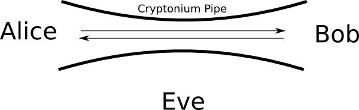
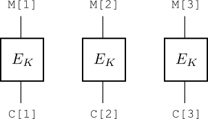
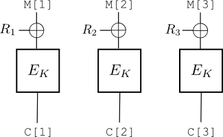
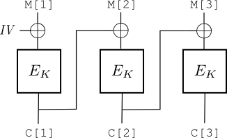

**********************************
Privacy and Symmetric Encryption
**********************************

Fundamental Problem
====================
Consider a scenario in which Alice wants to communicate with Bob over a possibly-insecure channel, such as the Internet.
Alice and Bob are worried that their enemy, Eve, will somehow be monitoring their communication and will be able to 
read and/or modify the messages they send to each other.

The main goals Alice and Bob want to achieve are the following:
   - *Privacy.*  Eve should not be able to read messages sent between Alice and Bob.
   - *Integrity.*  Eve should not be able to modify messages sent between Alice and Bob in an undetectable way.
   - *Authenticity.*  Eve should not be able to insert her own messages into the conversation in an undetectable way.  In other words, Alice should not be tricked into believing Eve's message is from Bob, nor should Bob be tricked into believing a message from Eve is from Alice. 

One way to think about these goals and cryptography is that we are trying to use mathematics to simulate a *cryptonium pipe* between 
Alice and Bob. 

This pipe should be impenetrable: Eve should not be able to see messages flowing through the pipe, nor should she be able to modify messages 
or insert her own.

To achieve the above goals, we will first consider tools that assume Alice and Bob share a secret value called 
a key :math:`K`.  Importantly, the adversary Eve should *not* know this secret value.  Since both Alice and Bob 
have access to the same key, there is symmetry.  Thus, we call the study of such tools 
**symmetric cryptography**.  (Later we will see tools for which Alice and Bob have different keys.  The study of 
those tools will be asymmetric cryptography.)

Classical Symmetric Encryption
===============================

Let us first turn our attention to the goal of achieving private communication between Alice and Bob.  As we 
stated above, we will assume that Alice and Bob share a secret value called the key.  If Alice and Bob are not in the same location, it is hard to imagine how they would come to share a key.  Establishing a shared key is a difficult 
problem, and we will explore it in more detail later.  For now, simply assume that Alice and Bob previously met in person (e.g., in a dark 
alley) and exchanged a key. 

The cryptographic tool for achieving privacy is **encryption**.  Since this is the symmetric key setting, 
we will refer to these tools as symmetric encryption schemes.  The two most important parts of a symmetric encryption 
scheme are the encryption program and the decryption program.

The encryption program :math:`\mathtt{enc}` should take as input the key :math:`K` and a message :math:`M`, and it should return a ciphertext :math:`C`.
Intuitively, :math:`\mathtt{enc}` should use :math:`K` to scramble the message :math:`M` so that the result, :math:`C`, is unintelligible to the adversary. 

The decryption program :math:`\mathtt{dec}` should take as input the key :math:`K` and a ciphertext :math:`C`, and it should 
output a message :math:`M`.  Decryption should undo encryption, meaning :math:`\mathtt{dec}` should unscramble :math:`C` back into :math:`M`.  This 
is formalized by requiring that :math:`\mathtt{dec}(K, \mathtt{enc}(K, M)) = M`.

Now, given such an encryption scheme, how can Alice and Bob privately communicate?  If Alice wants to send Bob 
the message :math:`M`, the following steps should take place 
   
   #. Alice runs :math:`\mathtt{enc}(K,M)` to generate the ciphertext :math:`C`.  
   #. Alice sends :math:`C` over the insecure channel to Bob. Eve, monitoring the channel, also sees :math:`C`.  
   #. Bob, also knowing the key :math:`K`, can then run the decryption program :math:`\mathtt{dec}` on :math:`K` and :math:`C` to recover the original message :math:`M`.

If we are using a good encryption scheme, then the adversary Eve, who we are assuming does not know :math:`K`, should be unable to 
make any sense out of the ciphertext. 

It may help to see some examples, so we next turn to what are sometimes called **classical ciphers** or 
**classical encryption schemes**.  While these encryption schemes are completely insecure and should never be used in practice, they 
should provide a good warm-up for understanding the syntax of encryption schemes and also help us get a feel for what it means for an encryption scheme to 
be *secure* or *insecure*.

The Caesar Cipher
------------------
Our first classical encryption scheme is the Caesar Cipher.  The name comes from Julius Caesar, 
who is rumored to have used this scheme to securely communicate with his generals when they were off at war.
The scheme is very simple (and very insecure).
The key :math:`K` is a number between 1 and 25 (Caesar apparently always used 3).  To generate a ciphertext, the 
encryption program :math:`\mathtt{enc}` shifts every letter of the message :math:`M` to the right :math:`K` positions.  For example, if the 
key is 3, 'a' would be shifted to 'd', 'b' would be shifted to 'e', and so on.  Letters at the 
end of the alphabet wrap back around to the beginning, so 'y' would be changed to 'b'.
Decryption simply undoes the encryption operation by shifting back to the left.  (**Fun Fact**: Shifting :math:`i` spots to the left 
is actually equivalent to shifting to the right :math:`26-i` positions.) 

-----------

Hands-on: Caesar Cipher at the Linux Command Line
^^^^^^^^^^^^^^^^^^^^^^^^^^^^^^^^^^^^^^^^^^^^^^^^^^^
We can apply the Caesar cipher easily 
at the Linux command line by using the ``tr`` command::  

   $ echo "hello world" | tr 'a-z' 'd-za-c'
   khoor zruog

The ``tr`` command, short 
for translate, converts each character in the first set to the corresponding character in the 
second set.  (The sets are given in single quotes above.)  Ranges can be used, so ``'a-d'`` 
actually represents ``abcd``.  Thus, the above command is equivalent to::

   $ echo "hello world" | tr 'abcdefghijklmnopqrstuvwxyz' 'defghijklmnopqrstuvwxyzabc'
   khoor zruog

-----------

Insecurity of the Caesar Cipher
---------------------------------
The Caesar Cipher is horribly insecure.  One of the 
problems with it is that there are only 25 possible keys.  
An encryption scheme with a small number of keys is susceptible to a **brute force attack**.
The attack is simple: Eve, upon observing a ciphertext :math:`C`, simply tries to decrypt it 
with every possible key, until she gets something that looks like a legitimate message.  In the worst case, 
it takes Eve just 25 decryptions to learn the message.  Clearly this is unacceptable.

The Substitution Cipher
------------------------
We now consider a generalization of the Caesar Cipher called the Substitution Cipher.  In a substitution cipher, each letter is randomly mapped to another arbitrary letter, not just shifted a constant amount to the right.
The key for this cipher is now a table like

.. math::
   \begin{array}{|c|c|c|c|c|c|c|c|c|c|c|c|c|c|c|c|c|c|c|c|c|c|c|c|c|c|}
   \hline
   a&b&c&d&e&f&g&h&i&j&k&l&m&n&o&p&q&r&s&t&u&v&w&x&y&z\\
   \hline
   h&c&x&m&g&u&s&r&t&e&a&y&z&o&p&n&d&b&l&i&v&q&k&w&f&j\\
   \hline
   \end{array}

Encryption with this key would map every 'a' to an 'h', 'b' to a 'c', and so on.  For example,
the encryption of "hello" under this key would be "rgyyp". 

In evaluating whether or not a substitution cipher is a good encryption scheme, it might first be useful 
to consider whether a brute force attack is possible.  With Caesar Cipher, there were only 25 different keys.  Let us now compute how many keys are possible in the substitution cipher.  If we are picking a random key, then there are 26 possible letters we can choose to have 'a' map to.  After we have made this choice, there are only 25 letters remaining to choose from for 'b'.   For 'c', there are 24 options.  Finally, when we get to 'y' there are 2 options and for 'z' there is only one letter left unassigned.  This means we in total had :math:`26 \times 25 \times \ldots \times 2 \times 1 = 26!` choices.  26 factorial is a very large number:

.. math::
   26! = 403291461126605635584000000 > 10^{26} \, .

With this many possible keys, a brute force attack is impractical.  Nevertheless, 
for us to declare an encryption scheme secure, we need to eliminate the possibility of any attack, not just one particular 
type of attack like brute forcing the key.

It turns out the substitution cipher is, like the Caesar Cipher, an insecure encryption scheme.  (You may have already guessed this, since this encryption method is used in the popular Cryptoquip puzzles that commonly appear in newspapers.)The easiest attack on the 
substitution cipher is **frequency analysis**.  This attack takes advantage of the fact that in English 
text, some letters are more common than others.  For example, it is well-known that 'e' is the most common letter in English, followed 
by 't'.
If we have a large sample of text encrypted with the key/table shown above, then counting the occurrences of every letter will likely 
show us that 'g' is the most common letter, followed by 'i'.  We now know where 'e' and 't' appear in the original message.  We can then use our knowledge of English to start filling in more blanks.  For example, we might see quite a few occurrences of "gri".  If we think that 'g' is 't' and 'i' is 'e', then it will likely follow that 'r' must be 'h', since the word "the" is very common in English.  We can continue deducing more and more letters using this technique until finally the entire message is revealed.

Perfect Encryption: The One-Time Pad
======================================

So far we have only discussed two very insecure symmetric encryption schemes.  These schemes have the additional
disadvantage of only working on messages consisting of letters. 
A good encryption scheme would ideally be able to encrypt arbitrary data.  For example, Alice might want to securely send Bob a sensitive picture or video, not necessarily just a text message.  Therefore, from now on we want to consider encryption schemes that operate on sequences of bits.  This is more in line with how computers represent data; every message, whether it is an email or a video or a pdf file, is already stored on your machine as a sequence of 0s and 1s, so it makes sense to focus on encrypting these bit sequences. 

As an example, suppose that Bob recently asked Alice out on a date and she would like to respond securely with either 'Y' for "yes" or 'N' for "no".  Computers often represent characters using ASCII encoding, so 'Y' would be represented by the bit sequence 01011001 and 'N' would be represented by 01001110.  Alice then wants to encrypt one of these two bit sequences.

Exclusive-OR
-------------
As we shall see, one of the most useful tools in encrypting bit sequences will be a simple operation called **exclusive-OR**.

Exclusive OR, usually referred to as XOR or denoted by :math:`\oplus`, is a boolean operation similar to an 
OR.  Logically, X XOR Y means "X or Y, but not both".  The truth table is thus as follows

.. math::
   \begin{array}{c|c|c}
   X & Y & X \oplus Y\\
   \hline
   1 & 1 & 0\\
   1 & 0 & 1\\
   0 & 1 & 1\\
   0 & 0 & 0
   \end{array} 

Another way to think about :math:`X \oplus Y` is as binary addition without carries (since the answer needs to be a single bit).  Thus, since 1+1 = 0 with a carry of 1 in binary, we throw away the carry and get 0.  (For mathematicians, this the same as addition modulo two.)

If :math:`X` and :math:`Y` are bit sequences that have equal lengths greater than 1, then :math:`X \oplus Y` will denote bitwise XOR, meaning that the XOR operation is done bit-by-bit.  For example, :math:`101 \oplus 110 = 011`.  In many programming languages (e.g., C), bitwise XOR is done through the ``^``  operator.  

We will need the following facts about bitwise XOR:

   #. :math:`X \oplus 0 = 0 \oplus X = X`
   #. :math:`X \oplus X = 0`
   #. :math:`X \oplus (Y \oplus Z) = (X \oplus Y) \oplus Z`
   #. :math:`X \oplus Y = Y \oplus X`

Encrypting and Decrypting with One-Time Pad
--------------------------------------------

One way to encrypt a sequence of bits is with one-time pad (OTP) encryption.  With OTP, Alice and Bob share a key consisting of a random sequence of bits the same length as the message they wish to securely exchange.  For our Y/N example, this means they would need to share a key that is a string of 8 random bits.  (To generate this key, perhaps they met in a dark alley and flipped a coin 8 times to generate the bits - heads would be a 1 and tails a 0.)
Suppose the key they agreed on is 11000101.  Encryption and decryption with the OTP are very simple, using bitwise exclusive-OR (XOR)

.. math::
   \mathtt{enc}(K, M) &= K \oplus M\\
   \mathtt{dec}(K, C) &= K \oplus C

Returning to our example with Alice and Bob, say that Alice wants to accept the date and reply with 'Y'.  
She would compute 

.. math::
   \mathtt{enc}(K,M) = \mathtt{enc}(11000101, 01011001) = 11000101 \oplus 01011001 = 10011100

and send this to Bob.  Bob, upon receiving the ciphertext :math:`C = 10011100` would compute

.. math::
   \mathtt{dec}(K,C) = \mathtt{dec}(11000101, 10011100) = 11000101 \oplus 10011100 = 01011001

Notice that Bob ends up with the bits representing 'Y'.  She accepts!

Why does decryption undo encryption?  We will formally prove it does using the properties in the XOR section above.  Consider the encryption of some message :math:`M` with key :math:`K`.  This is, by definition of :math:`\mathtt{enc}`, :math:`K \oplus M`.  Now, 

.. math::
   \mathtt{dec}(K, K \oplus M) &= K \oplus (K \oplus M)\\

   &= (K \oplus K) \oplus M\\

   &= 0 \oplus M\\

   &= M

where to go from the first to the last equation we used XOR properties 3 (also known as associativity), 2, and 1, respectively.
 
Next, let's briefly discuss why OTP is "perfect" encryption.  Suppose that an adversary Eve observes the ciphertext 10011100.  Further, let's give the adversary the benefit of knowing that Alice encrypted either 01011001 for 'Y' or 01001110 for 'N'.  This means that Eve knows the key must either be 11000101 or 11010010.  But, from Eve's point of view, both of those options are equally likely to be the key, since she wasn't in the alley when Alice and Bob flipped coins to randomly choose the key.    

Block Ciphers and Modes of Operation
======================================

While OTP is a secure way of encrypting bits, it turns out to have an enormous disadvantage: the key needs to be as long as the message, and can never be reused (which is why it's the "one-time" pad and not the "multiple-time" pad).
While this is fine when the message is short, as in our example above, it is insufficient if we want to encrypt larger messages (e.g., a large file).
For practical applications, we would instead prefer to have a short key (say, 100-200 bits) that can be used over and over again to encrypt both short and long messages.   

Block Ciphers
--------------
The central tool we will use to achieve this is called a block cipher.
A block cipher is an encryption algorithm that works on a fixed-size input called a block.  A popular example of a block cipher is AES, which has 128 bit keys and messages.  AES, when given a 128 bit key and a 128 bit message, will encrypt the message and output a 128 bit ciphertext.  One way to think of this is that every key gives us a table with messages in the left column and ciphertexts in the right column.  For example, the following table shows AES with the key set to all 0s (the table is shown in HEX, so 128 bits is 32 HEX characters). 

.. math::
   \begin{array}{c|c}
   \textbf{Message} & \textbf{Ciphertext}\\
   \hline
   \texttt{00000000000000000000000000000000} & \texttt{66e94bd4ef8a2c3b884cfa59ca342b2e}\\
   \hline
   \texttt{00000000000000000000000000000001} & \texttt{58e2fccefa7e3061367f1d57a4e7455a}\\
   \hline
   ... & ... \\
   \hline
   \texttt{ffffffffffffffffffffffffffffffff} & \texttt{3f5b8cc9ea855a0afa7347d23e8d664e}\\  
   \end{array}

This means that when the key :math:`K` is a 128 bit string of 0s (32 0s in HEX) and the message is also a 128 bit string of 0s, the ciphertext in HEX is 
66e94bd4ef8a2c3b884cfa59ca342b2e.  A good block cipher should appear to give random outputs for any key; thinking of our table, the right column should essentially be a random shuffling of the left column, where the shuffling is different for each key. As another example, the table for the key 1 followed by 127 0s (8 followed by 31 0s in HEX) starts with 

.. math::
   \begin{array}{c|c}
   \textbf{Message} & \textbf{Ciphertext}\\
   \hline
   \texttt{00000000000000000000000000000000} & \texttt{0edd33d3c621e546455bd8ba1418bec8}\\
   \hline
   \texttt{00000000000000000000000000000001} & \texttt{93e2c5243d6839eac58503919192f7ae}\\
   \hline
   ... & ... \\
   \end{array}

So, a good block cipher like AES gives us a way to encrypt 128 bit messages.  Unfortunately, this doesn't appear to help us much; recall that we are interested in encrypting both short and long messages, not just messages that are exactly 128 bits.  This is where **modes of operation** are needed.

Modes of Operation: ECB and CBC
---------------------------------

A **mode of operation** is a way to take a block cipher and re-use it to encrypt an arbitrary number of bits.  Probably the simplest way to do this is to split the message into 128 bit chunks and encrypt each chunk separately with the block cipher.   This mode of operation is known as ECB mode (ECB stands for "Electronic Code Book").  For the rest of the document, let :math:`M[i]` denote the :math:`i` th block of message :math:`M`.  We will denote by :math:`E_K(M[i])` the encryption of block :math:`M[i]` with block cipher :math:`E` using key :math:`K`; decryption of ciphertext block :math:`C[i]` will be denoted by :math:`E^{-1}_K(C[i])`.  Using this notation, to encrypt message :math:`M=M[1]\ldots M[n]` using ECB, one computes :math:`C = C[1]\ldots C[n]` where :math:`C[i] = E_K(M[i])`.  This can be seen pictorially 

but with M[2] and C[2] and M[3] and C[3], respectively.

Unfortunately, ECB mode is insecure.  The problem is that a block cipher is deterministic, meaning that if a block cipher is twice given the same key and the same message to encrypt, both times it will produce the same ciphertext.  Using our notation, if :math:`M[i] = M[j]`, then :math:`E_K(M[i]) = E_K(M[j])`.  Thus, when encrypting a long message, if two message blocks are the same, the corresponding ciphertext blocks will also be the same.  Because of this, patterns in the message become patterns in the ciphertext, and patterns are bad.  This is especially damaging when encrypting certain messages: for example, image data, as can be seen in the following images from the Wikipedia article on block cipher modes of operation (http://en.wikipedia.org/wiki/Block_cipher_mode_of_operation). 

The left image is the original, while the right is the result of encrypting the left with ECB mode. 

-------------------------------------

Hands-on: ECB is bad
^^^^^^^^^^^^^^^^^^^^^^^^^^^^^^^^^^^^^^^^
Let's explore the drawbacks of ECB mode using the Linux command line
and the OpenSSL command-line tool.  First, download the image file `<http://cs.stthomas.edu/cisc350/secret.bmp>`_ .  This type of bitmap image has a 54 byte header followed by bytes representing the image data.  We are going to use the command line to tear off the header, encrypt the bitmap data, and then put the header back on.  We can do this as follows.

Remove the 54 byte header and set it aside::

   $ head -c 54 secret.bmp > secretheader
   $ tail -c +55 secret.bmp > secretimagedata

At this point file :file:`secretheader` contains the 54 byte header and :file:`secretimagedata` contains the rest of the image, starting at byte 55.

We now encrypt the image data (we'll just use the key of all 0s)::

   $ cat secretimagedata | openssl enc -aes-128-ecb -K 0 > secretimagedata.enc

Finally, we combine the header and the encrypted image data into a new file called :file:`secret2.bmp`::

   $ cat secretheader secretimagedata.enc > secret2.bmp

---------------------------

How can we overcome the issues with ECB and destroy the patterns that emerge?  One idea is to mix random values into each block before encrypting with the block cipher.  Suppose we want to encrypt a 5 block message :math:`M[1],\ldots,M[5]`.  We could choose random values :math:`R_1,\ldots,R_5` and encrypt :math:`M[1] \oplus R_1`, up through :math:`M[5] \oplus R_5`.  A picture with three blocks would look like

This will certainly destroy any patterns that might be present in the message blocks, but how would one decrypt?  It is easy to see that in order for a receiver to retrieve the original message blocks, he would need to know the random values :math:`R_1,\ldots,R_5`.  Thus, they necessarily must be sent along with the ciphertext blocks, making the ciphertext :math:`R_1,\ldots,R_5, C[1], \ldots, C[5]`.
This works fine, but notice the length of the ciphertext has now doubled.  This is particularly bad if the message is very large (e.g., an entire hard drive).  Can we get something almost as good without so drastically increasing the number of bits that are sent?

It turns out we can.  Let's simplify things and consider encrypting a two block message :math:`M[1]M[2]`.  To encrypt using the technique above, we would first choose random value :math:`R_1` and compute :math:`E(K, R_1 \oplus M[1])` to generate :math:`C[1]`.  Now, we next want to encrypt :math:`M[2]` XORed with a random value, but instead of using :math:`R_2`, why not just use :math:`C[1]`?  The key observation is that if the block cipher is good, then :math:`C[1]` should essentially be a random value at this point, so there is no need to generate another random value :math:`R_2`.
If you continue this reasoning for more blocks, you get what is known as cipher block chaining (CBC) mode.

Specifically, in CBC mode, the first message block is XORed with a random value called the initialization vector (IV) and then encrypted with the block cipher, while subsequent message blocks are XORed with the previous ciphertext block before being encrypted by the block cipher.  Put another way, to encrypt message block :math:`M[i]` using block cipher :math:`E` under key :math:`K`, one computes :math:`C[i] = E_K(M[i] \oplus C[i-1])` (since there is no 0th ciphertext block, we pick a random :math:`\mathit{IV}` and let :math:`C[0]=\mathit{IV}`).  To reverse this process and decrypt the :math:`i` th ciphertext block, one computes :math:`M[i] = E^{-1}_K(C[i]) \oplus C[i-1]`.  This entire process on a 3 block message would look like 

d box M[2] XOR C[1].  The second box output C[2] is also rerouted up to the input to the third box, making the third box input M[3] XOR C[2].

----------------------------

Hands-on: CBC Mode 
^^^^^^^^^^^^^^^^^^^^^^^

Let's see how to encrypt with CBC mode.  Suppose we want to encrypt the message ``hello there`` using CBC mode with AES as the block cipher.  We can do this as follows::

   $ echo "hello there" | openssl enc -aes-128-cbc -K 0 -iv 0 > hello.enc

(We have chosen the key of all 0s and an IV of all 0s in the above; in practice we would want to type 32 random HEX characters in both spots.)

We can see what the ciphertext blocks look like by displaying ``hello.enc`` in hex::

   $ cat hello.enc | xxd -p

Finally, to decrypt, we just add the ``-d`` flag::

   $ cat hello.enc | openssl enc -d -aes-128-cbc -K 0 -iv 0 
   hello there

-----------------------------

CBC mode is probably the most popular way to encrypt using AES. In the next section we will see that using it alone is not enough to ensure the security of our communications.  But first, we need to briefly discuss padding. 

Padding
---------

To use the modes of operation discussed above, we said one chops the message up into blocks.  If the block cipher is AES, for example, we would need to divide our message into 128-bit (16 byte) blocks.  But what if our message size is not a multiple of 16 bytes (which we'll call the **block size**)?  To deal with this issue, we need a padding scheme - a way to add extra bytes to a message to make its size an exact multiple of the block size.
One common way to pad messages is with PKCS #5 padding.  In this padding scheme, each byte of padding, when interpreted as an integer, gives the total number of padding bytes needed.  For example, suppose we want to encrypt the message ``hello``.  Since the message is only 5 bytes but the block size is 16, we need 11 padding bytes.  The number 11, as a byte, is ``0b``, so the actual message encrypted is ``hello`` followed by eleven ``0b`` bytes.   

-------------------------------

Hands-on: Padding in OpenSSL 
^^^^^^^^^^^^^^^^^^^^^^^^^^^^^^

Let's explore padding using OpenSSL.  First, encrypt the message ``hello`` (we use ``-n`` in ``echo`` so that it doesn't add a newline character)::

   $ echo -n "hello" | openssl enc -aes-128-cbc -K 0 -iv 0 > hello5.enc

We then decrypt with the ``-nopad`` option and pipe the result to ``xxd`` to see the HEX of the decrypted bytes::

   $ cat hello5.enc | openssl enc -d -aes-128-cbc -nopad -K 0 -iv 0 | xxd -p
   68656c6c6f0b0b0b0b0b0b0b0b0b0b0b

Notice there are 11 ``0b`` bytes present at the end.

--------------------------------

Encryption and Authenticity/Integrity
=======================================

We have just seen how to use encryption to achieve our goal of privacy.
But, as we described earlier, privacy is not the only goal we have when using cryptography.  
We are also interested in the authenticity and integrity of our digital messages.   In short, we do not 
want adversaries to be able to modify our messages in undetectable ways; if Eve modifies a message sent from Alice to Bob, 
cryptography should help Bob detect this.  

A very common mistake is to think that encryption automatically provides integrity and authenticity.  For example, it is tempting 
to think that using CBC-mode encryption prevents adversaries from modifying messages.  Unfortunately, this is completely false.  The 
encryption schemes we have so far discussed are intended to provide privacy.  If we want integrity and/or authenticity, we will need to use 
different tools and techniques.

To further illustrate this important point, consider one-time pad encryption again.  Recall that as long as the key is as long as the message, 
one-time pad encryption is a perfect encryption scheme.  Let's see whether or not our perfect encryption scheme also gives us integrity.  

In our OTP scenario, Alice and Bob shared a key K=11000101 and Alice used the key to encrypt for Bob either 'Y'=01011001 or 'N'=01001110.  Suppose that our adversary Eve knows that either 'Y' or 'N' is the message, but doesn't know which one Alice is going to send.  Here is the attack: when Eve observes the ciphertext, she flips the 4th, 6th, 7th, and 8th bits, and forwards the modified ciphertext on to Bob.  Let's look at what happens depending on which message Alice encrypted:

   * If Alice encrypted 'Y', the ciphertext would have been :math:`11000101 \oplus 01011001 = 10011100`.  After Eve flips bits 4,6,7, and 8, this becomes 10001011.  Bob then decrypts this modified ciphertext and gets :math:`10001011 \oplus 11000101 = 01001110` which translates to 'N'.
   * If Alice encrypted 'N', the ciphertext would have been :math:`11000101 \oplus 01001110 = 10001011`.  After Eve flips bits 4,6,7, and 8, this becomes 10011100, which Bob decrypts into :math:`10011100 \oplus 11000101 = 01011001` which translates to 'Y'.

Thus, we can see that Eve was able to change the encrypted message to the exact opposite just by flipping a few bits in the ciphertext.  Even though OTP is perfect encryption, it gives no protection against attacks against the integrity of the underlying message.  If we want integrity and authenticity, we will need different tools and techniques.  We will explore these in the next chapter.

